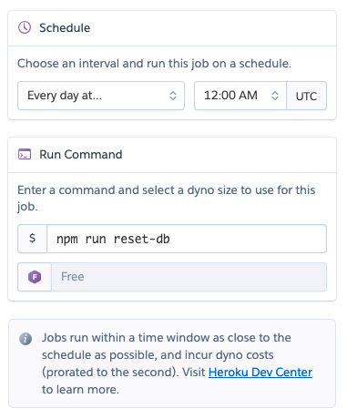

# Veterinarian API

This server is intended to be used with the Emagi Project.

## Implementation

This server is created using the [`json-server`](https://www.npmjs.com/package/json-server) NPM package.

Some of the data came from [this Kaggle dataset.](https://www.kaggle.com/aaronschlegel/seattle-pet-licenses)

### Resources

The following resources exist:

- Pets: `/api/pets`
- Owners: `/api/owners`
- Owners/Pets: `/api/owners_pets`
- Employees: `/api/employees`

## Installation

1. Clone the repository.
1. `npm install`
1. `npm start`

## Deployment with Heroku

1. Install the [Heroku CLI](https://devcenter.heroku.com/articles/heroku-cli).
1. Login to your Heroku CLI with `heroku login`.
1. `heroku create`
1. `git push heroku main`

### Setting up Heroku Scheduler

If students will be modifying the data from this API, it is a good idea to regularly reset the database. You can do so by using the [Heroku Scheduler](https://devcenter.heroku.com/articles/scheduler).

From the command line, run the following command:

```
heroku addons:create scheduler:standard
```

Then, run the following command:

```
heroku addons:open scheduler
```

Finally, add a new job. You can set the `npm run reset-db` command to run as often as you like.


